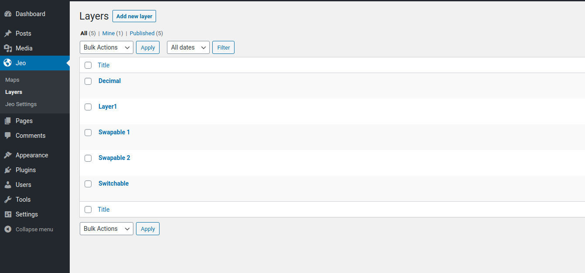
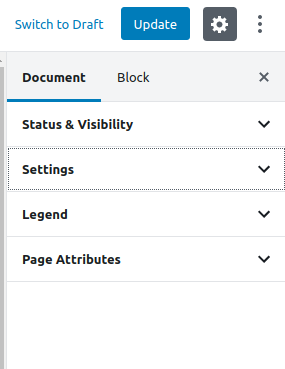
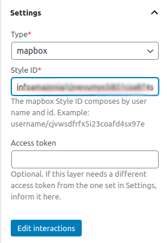
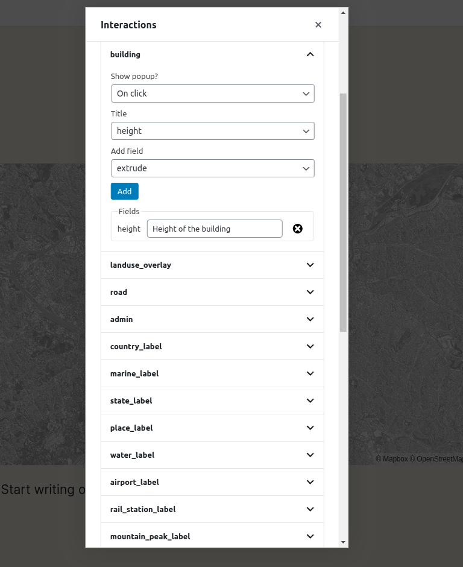
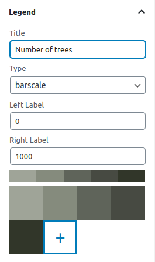

# Creating a layer

One of the custom post types that JEO plugin provides is **Layer**. Is in the layer where you will be able to add legend and color to your map. A map may contain one or more layers.

Entering the Layer post editor, you'll see a preview of the current layer (or a default layer if the current layer haven't been edited yet) and two sidebar panels: **Settings** and **Legend**.

## Layer settings

On the **Layer settings** panel, you can change the layer type.

JEO supports four layer types out-of-the-box:

- [Mapbox styles](https://docs.mapbox.com/studio-manual/overview/map-styling/)
- [Mapbox tilesets](https://docs.mapbox.com/help/glossary/tileset/)
- [Mapbox vector tiles](https://docs.mapbox.com/vector-tiles/reference/) (MVTs)
- [TileLayers](https://en.wikipedia.org/wiki/Tiled_web_map)

 You can also inform an address, following the standard `username/id`, to compose your map style. If an access token is needed for this layer, you can put it into the `Acess token` input.

There's also an **Edit interactions** button. Here, you can add popups to your layer when specific actions (clicking or hovering the mouse) are made (e.g.: Clicking on a building and displaying its height)

## Layer legend

On the **Layer legend** panel, you can add legends to your layer (barscale, simple-color, icons or circles and colorize them.

TODO: layer legend

