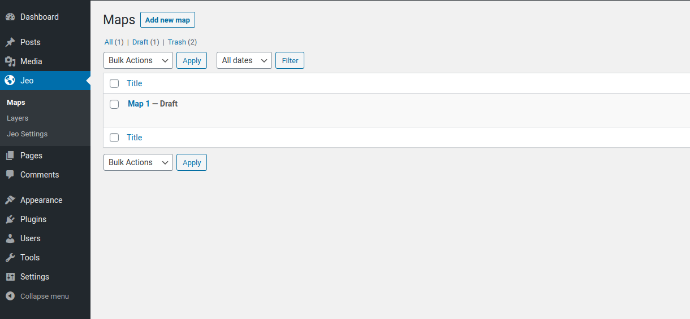
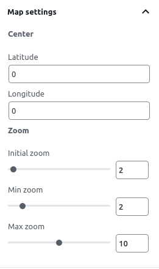
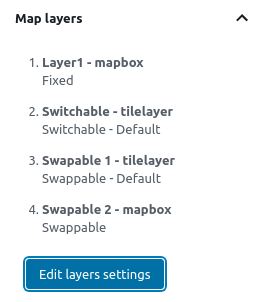
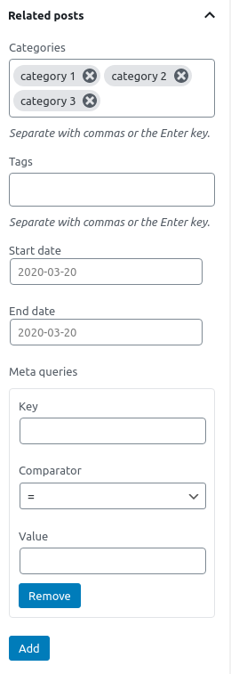

# Creating maps

One of the custom post types that JEO plugin provides is **Map**.

Entering the Map post editor, you'll see a preview of the current map (or a default map, if no layers are selected) and three sidebar panels: **Map settings**, **Map layers**, and **Related posts**.

## Map settings

On the **Map settings** panel, you can change the initial center of the map setting a latitude and longitude. You can also change the default zoom settings.

## Map layers

On the **Map layers** panel, you can visualize all the layers which are part of the map.

Clicking on the **Edit layers settings**, a popup will open. There, you can add, remove and rearrange layers, define their types and whether its legends will be shown on the map.

A legend can be of one of these types:

- **Fixed**: the layer will always be shown in the map;
- **Switchable**: the layer visibility can be toggled on and off;
- **Swappable**: only one swappable layer can be visible at a time.

## Related posts

On the **Related posts** panel, you can set which geolocated posts will be used as markers on the post. You can filter the posts by categories, tags, dates interval or, for advanced uses, meta queries using WordPress `post_meta`.

